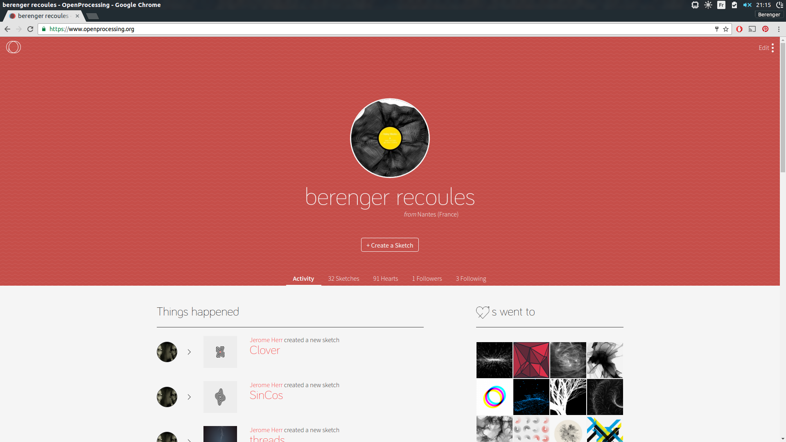
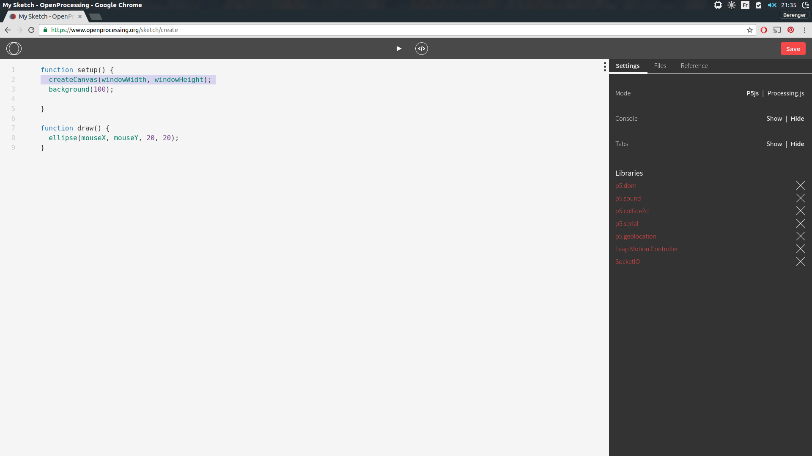
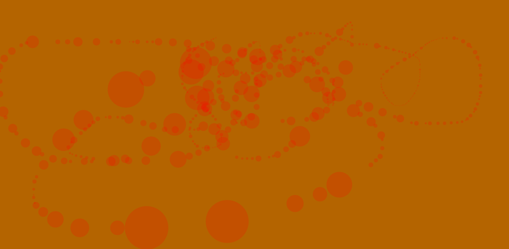
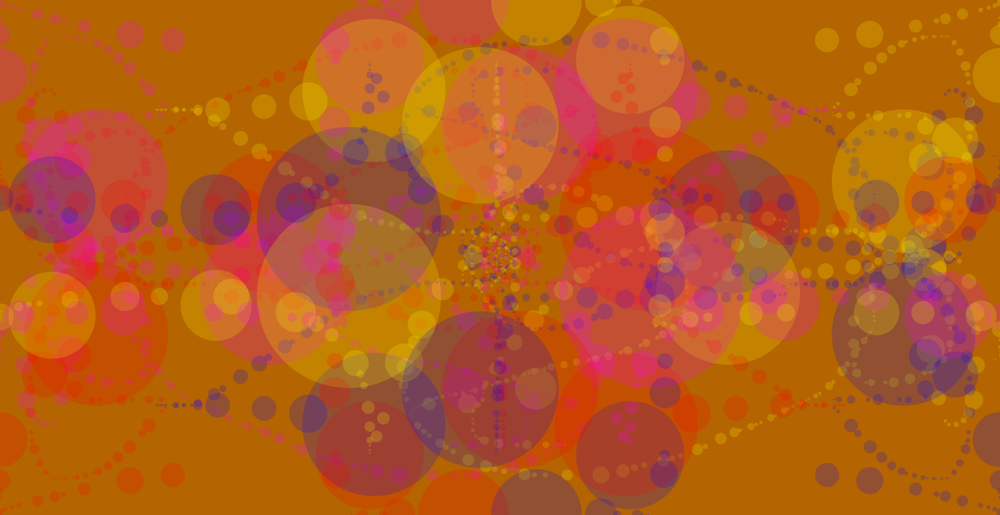
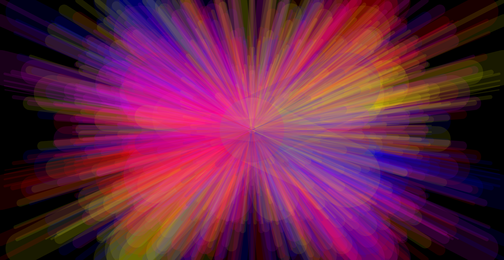
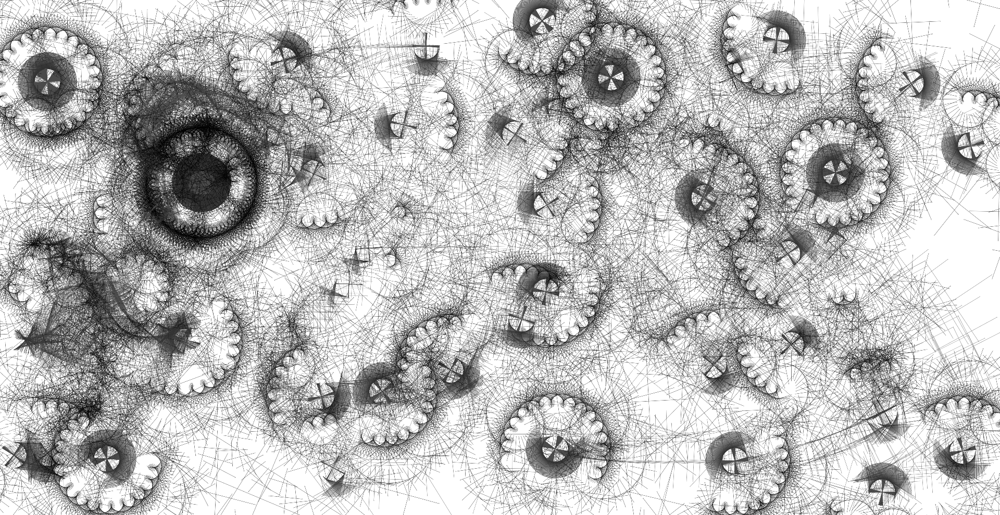
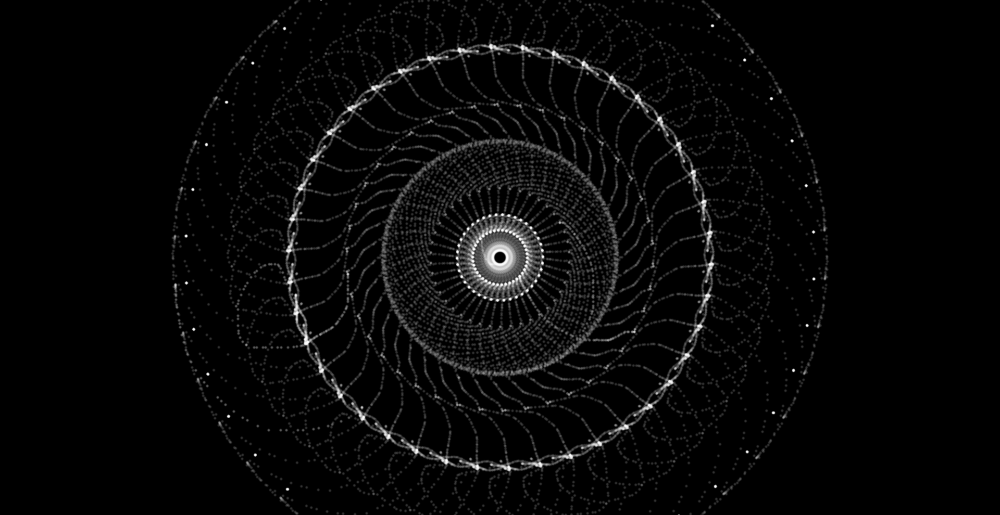
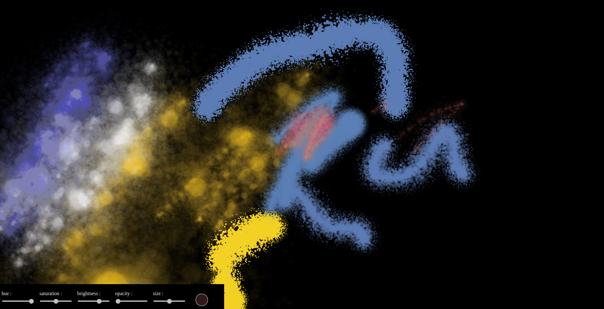
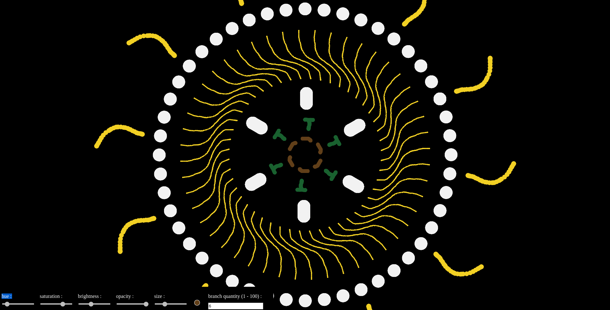
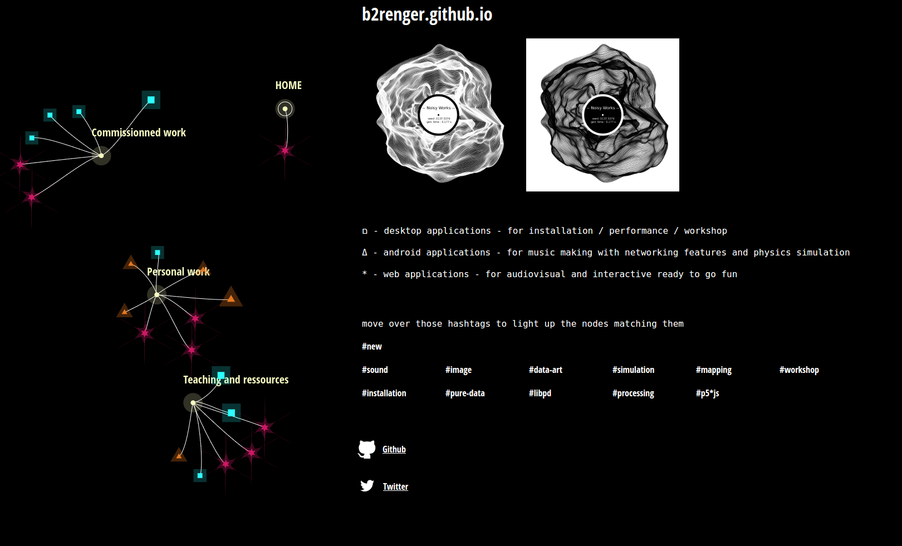

# Introduction_p5js

This is a french introduction to p5*js : http://p5js.org

P5js est un projet issu de processing qui est un langage de programmation basé sur java orienté vers la création graphique et interactive. P5js a pour but de transposer l'esprit de processing au web et donc au langage javascript. C'est un framework simple d'accès pour les débutants avec une bonne documentation et une communauté active. 

P5js propose l'intégration dans un canvas html5 d'un maximum de fonction pour le dessin et d'animation, des possibilités d'interaction à travers différentes interfaces homme machine (clavier, souris, webcam, micro ...), ou encore avec les composants d'une page web et un support partiel mais en développement de webgl.

De nombreuses librairies viennent offrir de nouvelles possibilité, mais il p5js peut naturellement s'interfacer avec n'importe quelle librairies js.

P5js est différent de processing.js par le fait que le langage de base est le js. Lorsqu'on utilise processing.js on a générallement développé un programme avec processing et on utilise processing.js pour traduire le programme en javascript qui devient alors exécutable dans une page web. Avec p5js on code directement en javascript un langage natif pour les navigateurs.

Cette introduction va couvrir l'essentiel du workflow avec p5js, présenter les différentes fonctions de dessin et la base de la programmation en js ( conditions, boucles for et fonction + prototypage d'objets javascript).

<a name="contenu"/>
## Contenu

* [Comment travailler avec p5js](#p5js_tools)<br>
* [Principes de bases](#bases)<br>
* [Dessiner avec la souris](#dessiner)<br>
	*	[Les couleurs et la transparence](#couleurs)<br>
	*	[Utilisation de variables](#simuler) - [demo link](https://b2renger.github.io/Introduction_p5js/01_dessiner_01/index.html)<br>
	*	[Réaliser des symétries](#symetries)<br>
	*	[Créer des fonctions javascript](#fonctions)<br>
	*	[Utiliser les transformations de l'espace : effet spirographe](#transformations)<br>
	*	[Conditions, boucles et coordonnées polaires : effet "spray-can"](#spray)<br>
		*	[Conditions : "if"](#conditions)<br>
		*	[Coordonnées polaires](#polaire)<br>
		*	[Boucles : "for"](#boucles)<br>
* [DOM](#dom)<br>
	*	[Utilisation de la librairie](#utilisation)<br>
	*	[Créer des éléments HTML5](#html5)<br>
	*	[Styliser avec du css](#css)<br>
	*	[Exemple de site web](#siteweb)<br>
* [Animation et objets](#animation)<br>
* [SocketIO](#socket)<br>
* [Ressources](#ressources)<br>
* [Références](#references)<br>


<a name="p5js_tools"/>
## Comment travailler avec p5js

Vous avez plusieurs choix : 


### openprocessing

Openprocessing est une plateforme collaborative qui permet de coder avec p5js ou processing.js. Il suffit de créer un compte gratuit et de cliquer sur 'create a new sketch' et c'est partit ! Openprocessing permet d'uploader des images, des vidéos ou des sons et supporte plusieurs librairies y compris un librairie websocket qui permet à plusieurs utilisateur d'interagir à distance dans un même canvas.

[Openprocessing](http://openprocessing.org)

La plupart des exemples de ce cours seront probablement porté sur openprocessing à une date indéfinie. Mais vous pouvez copier l'intégralité du fichier "sketch.js" de n'importe quel dossier dans l'éditeur de code d'openprocessing, puis de cliquer sur "run".

Il est aussi possible d'intégrer des librairies javascript externes voici un exemple pour faire cela : https://www.openprocessing.org/sketch/385808

Openprocessing est pratique car il permet de se passer de serveur local et permet de créer des portofolio d'applications interactives très facilement. Actuellement openprocessing connait malheureusement quelques soucis, l'intégration de la librairie DOM pose parfois problème, et le serveur websocket plante régulièrement (mais le nouveau site est récent, ces problèmes se dissiperont avec le temps)





### editor

Il existe une application windows, osx ou linux, faisant office d'éditeur et de serveur web. Il est disponnible sur la page de téléchargement de p5js

http://p5js.org/download/

L'éditeur fait aussi office de serveur, et permet donc de travailler avec des images, vidéos et sons, sans avoir à lancer de serveur local.


### developpeur web 

Le plus simple est probablement de [télécharger](http://p5js.org/download/) et d'ajouter la librairie js ou d'utiliser les liens cdn dans votre fichier index.html.

Pour rappel CDN signifie Content Delivery Network et permet de lier son code à des librairies qui sont déjà hébergées en ligne.

Généralement un bon éditeur de texte suffit. Parfois il pourra être utile d'utiliser un serveur local pour servir certaines pages demandant accès à des fonctions ou fichiers spécifiques (généralement des pages utilisant des images ou des sons sous formes de fichier doivent être ouvertes avec un serveur local). Il y a des nombreuses possibilités pour cela et beaucoup de documentation en ligne : personnellement j'utilise 'sinatra' un serveur en ruby, simplehttpserver pour python peut-être une alternative, ou d'autres encore via nodejs voire même des logiciels comme mamp.


### des librairies

P5js recense un bon nombre de librairies compatibles et revendiquant le même esprit : http://p5js.org/libraries/
Mais il peut aussi être utilisé avec n'impote quelles autres librairies js.

[^ home](#contenu)<br>


<a name="bases"/>
## Les principes de bases

Un programme p5js est destiné à être utilisé dans une page web. Généralement en dispose d'un fichier *index.html* qui nous permet de définir notre page web et les fichiers ressources (liens vers les librairies) et d'un fichier *sketch.js* qui va être notre programme écrit en javascript.

### HTML et JS

Le fichier *sketch.js* est lié au fichier *index.html* par une déclaration dans ce dernier.

```HTML
<script language="javascript" type="text/javascript" src="sketch.js"></script>

```
Lorsqu'on ouvre le fichier *index.html* celui-ci executera alors le fichier *sketch.js* dans la page web.

Dans le cas de nos exemples nous trouverons les librairies javascripts dans un dossier **/librairies** dédié : on y trouve *p5.js*, *p5.dom.js*, *p5.sound.js*.

Le fichier *index.html* ressemblera donc à ceci si on utilise toutes les librairies :

```HTML
<html>
<head>
  <meta charset="UTF-8">
  <script language="javascript" type="text/javascript" src="../libraries/p5.js"></script>
  <script language="javascript" type="text/javascript" src="../libraries/p5.dom.js"></script>
  <script language="javascript" type="text/javascript" src="../libraries/p5.sound.js"></script>
  <script language="javascript" type="text/javascript" src="sketch.js"></script>
  <style> body {padding: 0; margin: 0;} </style>
</head>
<body>
</body>
</html>
```


### p5js

Notre fichier *sketch.js* est notre code écrit en javascript. Par défaut : il contient deux fonctions nécessaires à l'éxecution des fonctions de l'api p5js (Application Programming Interface)

```javascript

function setup() {

}

function draw() {
  
}

```

La fonction **setup()** est executée une fois à chaque chargement de la page, elle est utile pour initialiser des valeurs ou créer des éléments de page web - comme un canvas pour dessiner :

```javascript
function setup() {
    // créer un objet de type HTML5 canvas aux dimension de la fenêtre de notre navigateur
	createCanvas(windowWidth,windowHeight) 
}
```

**windowWidth** et **windowHeight** sont des **variables** disponnible dans processing pour renseigner le programme sur la taille de la fenêtre du navigateur de l'utilisateur.

Une **variable** est quant à elle un espace mémoire dans le navigateur accessible par notre programme. En javascript nous devrons créer et manipuler des variables régulièrement, mais p5js dispose de certaines variables déjà nommées pour connaitre l'état du navigateur ou la position de la souris ou même encore les touches pressées par l'utilisateur.

La fonction **draw()** est elle une boucle infinie : le code entre les deux accolades est éxecuté en boucle par votre navigateur aussi vite que possible. Cela tranche avec le principe évenementiel du javascript, mais ici nous allons faire des applications interactives avec de l'animation.

Vous pourrez trouver la référence du langage p5js ) cette adresse : http://p5js.org/reference/


[^ home](#contenu)<br>


<a name="dessiner"/>
## Dessiner avec la souris

Le premier code sur lequel nous allons travailler est un programme de dessin. Lorsque vous créez un nouveau 'sketch' sur openprocessing vous vous retrouvez avec ce code sous les yeux :

```javascript
// initialisation du programme
function setup() {
  // création d'un canvas à la taille de la fenêtre du navigateur
  createCanvas(windowWidth, windowHeight); 
  // création d'un fond gris
  background(100);  
  
} 

// boucle d'execution de notre application
function draw() {
  // dessiner un rond à l'endroit de la souris
  ellipse(mouseX, mouseY, 20, 20);
}
```

Chaque execution d'une boucle draw dessine un cercle de 20 pixels au coordonnées de la souris. Il faut noter que le repère de coordonnées dans p5js par défaut place l'origine, c'est à dire le point de coordonées (0,0) en haut à gauche. Les abscisses sont croissantes lorsqu'on se déplace vers la droite et les ordonnées croissantes lorsqu'on se déplace vers le bas.

Vous pouvez expérimenter avec ce programme pour vous en rendre compte : 

- https://www.openprocessing.org/sketch/388459

**ellipse** est un mot clé permettant de dessiner une ellipse d'une taille précise à une endroit précis en lui passant des **paramètres**, ce sont les valeurs que l'on donne entre parenthèses :

* les deux premier paramètres sont les coordonnées de l'endroit où dessiner l'ellipse
* les deux suivant sont la largeur et la hauteur de l'ellipse.

**mouseX** et **mouseY** sont des variables globales définies par processing et donnent la position de la souris au moment du calcul de l'image en les utilisant comme les deux premiers paramètres pour le dessin de notre ellipse on change la position de dessin et on dessine à l'emplacement de la souris.

La page de référence concernant l'ellipse nous renseigne sur tout cela : http://p5js.org/reference/#/p5/ellipse

Il est possible de dessiner bien d'autres formes ou **primitives** en 2d ou en 3d. Il est aussi possible de composer des formes complexes à l'aide de courbes de béziers ou de vertex.

Voici la page de référence sur les formes : http://p5js.org/reference/#group-Shape

Dans ce programme le fond n'est jamais rafraichit et donc les cercles sont dessinés les uns après les autres sur un fond gris. Si vous rajoutez la commande 

```javascript
background(100)
```

à ce moment là : à chaque image le fond sera remplacé par un fond gris avant dessiner notre ellipse. Le résultat sera alors un rond qui suivra la position de la souris.


[^ home](#contenu)<br>


<a name="couleurs"/>
### Les couleurs et la transparence
 
Pour coloriser nos dessins il est possible d'utiliser les fonctions **stroke()** ou **noStroke()** et **fill()** ou **noFill()**.
"stroke" signifie contour et permet donc de préciser la couleur du trait, et "fill" signifie remplissage et permet donc de préciser la couleur de remplissage de la forme. A partir du moment ou sont fonctions sont appelées, elles s'appliquent à tous les dessins qui suivent.

Ce programme vous permettra d'illustrer l'utilisation de ces fonctions : https://www.openprocessing.org/sketch/181425

Le comportement de ces fonctions est particulièrement modulaire comme le présente la page de doc : http://p5js.org/reference/#/p5/fill

Pour résumer:

* si vous n'utilisez qu'un paramètre vous êtes en niveau de gris : 0 = noir / 255 = blanc
* si vous utilisez trois paramètres vous êtes en rgb : chaque paramètre étant compris entre 0 et 255 => fill(255,0,0) donnera du rouge
* si vous utilisez quatre paramètres vous ajoutez un cannal alpha pour gérer la transparence : 0 étant transparent et 255 opaque
* vous pouvez aussi utiliser du code hexa-décimal pour rentrer des couleurs
* il est possible de passer du mode rgb au mode hsb grace à la fonction **colorMode()**

Voici le programme précédent avec de nouvelles couleurs :

```javascript
function setup() {
  createCanvas(windowWidth, windowHeight); 
  background(180,100,0);  
  
} 

function draw() {
  // cercle à la position de la souris
  fill(255,0,0,50)
  noStroke()
  ellipse(mouseX, mouseY, speed, speed);
 }
 ```


[^ home](#contenu)<br>


<a name="simuler"/>
### utilisation de variables :"Simuler" un pinceau

Nous allons vouloir maintenant compléxifier notre programme. La première chose que nous allons faire est de rendre le dessin un peu plus sensible. L'idée serait de faire en sorte que lorsque notre geste est rapide les cercles soit gros et qu'ils soient petit quand notre geste est lent (une sorte de pinceau inversé).

Pour cela nous allons essayer de calculer une valeure qui soit proportionelle à la vitesse de déplacement de notre souris. P5js dispose de deux variable dédiées pour connaitre aussi la position de la souris à l'image précédente : elles s'appellent **pmouseX** et **pmouseY**. A partir de la nous pouvons calculer la moyenne du déplacement en abscisses et en ordonnées entre deux images.

Nous allons donc créer une variable javascript que nous allons appeler *speed* pour stocker cette valeur :

```javascript
var speed=(abs(pmouseX-mouseX)+abs(pmouseY-mouseY))/2

```
puis utiliser cette valeur comme paramètre de la taille de nos ellipses :

```javascript
ellipse(mouseX, mouseY, speed, speed)

```

Nous pouvons aussi calculer une vraie valeur physique en calculant la magnitude du vecteur directeur du mouvement entre deux images ! Il s'agit simplement d'appliquer le théorème de Pythagore :

```javascript
var speed=pow(pow(pmouseX-mouseX,2)+pow(pmouseY-mouseY,2),0.5)
```

Nous obtenons alors notre premier exemple disponnible dans le dossier */01_dessiner_01*

```javascript
function setup() {
  createCanvas(windowWidth, windowHeight); 
  background(180,100,0);  
  
} 

function draw() {
  
  var speed=(abs(pmouseX-mouseX)+abs(pmouseY-mouseY))/2

  fill(255,0,0,50)
  noStroke()
  ellipse(mouseX, mouseY, speed, speed);
}
```



https://www.openprocessing.org/sketch/388464

https://b2renger.github.io/Introduction_p5js/01_dessiner_01/index.html


[^ home](#contenu)<br>


<a name="symetries"/>
### Réaliser des symétries

Nous allons maitenant réaliser différentes symétries pour compléxifier le rendu de notre programme de dessin. Dans le cadre de notre reprère processing réaliser une symétrie est relativement simple. 

Avec un peu d'astuce on se rend compte qu'une symétrie axiale consiste à faire en sorte que les distance entre deux bords parallèles délimitant un espace de dessin soit la même.

Ainsi : 

```javascript
  ellipse(mouseX, mouseY, speed, speed);
  ellipse(mouseX, windowHeight-mouseY, speed, speed);
```
permet de dessiner une ellipse aux coordonnées de la souris et une par symétrie axiale horizontale au centre de notre canvas.


```javascript
  ellipse(mouseX, mouseY, speed, speed);
  ellipse(windowWidth-mouseX, mouseY, speed, speed);
```
permet de dessiner une ellipse aux coordonnées de la souris et une par symétrie axiale verticale au centre de notre canvas.

et finalement : 

```javascript
  ellipse(mouseX, mouseY, speed, speed);
  ellipse(windowWidth-mouseX, windowHeight-mouseY, speed, speed);
```
permet de dessiner une symétrie centrale !

Notre programme devient donc :

```javascript
function setup() {
  createCanvas(windowWidth, windowHeight); 
  background(180,100,0);  
  
} 

function draw() {
  
  // magnitude du vecteur directeur de la souris avec pythagore
  //var speed=pow(pow(pmouseX-mouseX,2)+pow(pmouseY-mouseY,2),0.5)/2 
  // ou une expression beaucoup plus simple ... après tout on souhaite juste que la taille des cercles
  // soit  dépendente de la vitesse à laquelle on bouge la souris 
  var speed=(abs(pmouseX-mouseX)+abs(pmouseY-mouseY))/2

    // cercle à la position de la souris
  fill(255,0,0,50)
  noStroke()
  ellipse(mouseX, mouseY, speed, speed);
  
  // symetrie axiale verticale
  fill(255,0,255,50)
  ellipse(mouseX, windowHeight-mouseY, speed, speed);
  
  // symetrie axiale horizontale
  fill(0,0,255,50)
  ellipse(windowWidth-mouseX, mouseY, speed, speed);
  
  // symetrie centrale
  fill(255,255,0,50)
  ellipse(windowWidth-mouseX, windowHeight-mouseY, speed, speed);
}

```



https://www.openprocessing.org/sketch/388181

https://b2renger.github.io/Introduction_p5js/01_dessiner_02/index.html

Pour vous exercer vous pouvez essayer de dessiner des lignes (fonction **line()**)provenant du centre de la fenêtre à la souris, ainsi qu'à ses quatres positions symétriques. Vous pouvez aussi faire varier la taille des traits grace à la fonction **strokeWeight()**. Ce qui vous donnera un résultat similaire à celui-ci



https://www.openprocessing.org/sketch/388511

https://b2renger.github.io/Introduction_p5js/01_dessiner_03/index.html


[^ home](#contenu)<br>


<a name="fonctions"/>
### Fonctions

En javascript, il est assez facile de définir de nouvelles fonctions : il suffit de créer une variable un peu particulière, une variable qui est en réalité un bout de code js. Par exemple pour créer une fonction permettant de dessiner un carré il suffit d'écrire ceci à la racine de notre fichier sketch.js (c'est à dire en dehors de la fonction draw ou de la fonction setup)

```javascript
var draw_square = function(x,y,size){ // on crée la fonction et on définit les paramètres nécessaires
	rect(x,y,size,size) // code nécessaire au dessin d'un carré en fonction des paramètres
}
```

Pour utiliser cette fonction, il nous suffit alors cette fois dans le **draw()** de l'appeler avec les paramètres adéquats.
```javascript
draw_square(25,25,50) // dessiner un carré au coordonnées (25,25) dont le côté fait 50 pixels.
```

[^ home](#contenu)<br>


<a name="transformations"/>
### Transformation de l'espace : effet spirographe

Pour l'instant nous avons vu que le repère dans lequel on exprimait les coordonnées dans était fixe. Mais il est possible de le déplacer et de le faire tourner. Cela peu notament être utile pour faire tourner un carré autour de son centre.

Pour cela il faut utiliser les fonctions **translate()** et **rotate()**

Cet exemple interactif vous permettra probablement de mieux comprendre l'utilisation conjointe des deux fonctions. Il est aussi important de savoir qu'il existe deux fonctions **push()** et **pop()** qui fonctionnent de manière conjointe : **push()** permet de créer un nouveau repère pour le transformer et **pop()** permet de restaurer le repère original de processing. Si jamais vous utilisez push() vous devez utiliser pop() sous réserve d'avoir des erreurs à l'exécution.

Nous allons pouvoir maintenant faire tourner un rectangle autour de son centre en modifiant la fonction que nous avions précédement écrite :

```javascript
var draw_rect = function(x,y,size,rot){
  push()
  rectMode(CENTER) // utiliser le centre du carré comme ancre de dessin
  translate(x,y) // déplacer le repère
  rotate(rot) // le faire tourner sur lui même en fonction d'une valeur d'angle
  rect(0,0,size  ,size)
  pop()
 }
``` 

**push()** et **pop()** peuvent aussi être imbriqués les uns dans les autres.

```javascript
var draw_rect = function(x,y,size,rot){
  // nouveau repère r1
  push() 
  rectMode(CENTER)
  translate(x,y)
  rotate(rot)
  rect(0,0,size  ,size)

  // nouveau repère r2 qui bénificie encore des transformation de r1
  push() 
  translate(-50,-50) // notre rectangle va tourner autour du centre de r1 à une distance calculable par pythagore : d = pow(50*50+50*50,0.5)
  rotate(PI/2)
  rect(0,0,size  ,size)
  pop() // on supprime les transformation de r2

  // et on crée un nouveau repère r3 qui est donc dans l'état de r1
  push() 
  translate(100,100) // notre rectangle va tourner autour du centre de r1 à une distance calculable par pythagore : d = pow(100*100+100*100,0.5)
  rotate(rot*3) // et il va tourner sur lui même
  rect(0,0,size  ,size)
  pop() // on supprime les transformation de r3

  pop() //on supprime les transformation de r1

  // nous sommes de nouveau dans le repère d'origine
}

```

Le programme suivant garde se principe, ajoute un niveau de rotation et  ne dessine plus de rectangles mais uniquement des lignes représentant les repères tournants les uns autour des autres :

```javascript
var draw_lines = function(x,y,size,rot){

    strokeWeight(0.15)
  // nouveau repère r1
  push() 
  rectMode(CENTER)
  translate(x,y)
  rotate(rot*0.15)
  stroke(75)
  // dessiner une croix
  line(0,size,0,-size)
  line(-size,0,size,0)

  // nouveau repère r2 qui bénificie encore des transformation de r1
  push() 
  rotate(rot)
  translate(-size,-size) // notre croix va tourner autour du centre de r1 à une distance calculable par pythagore : d = pow(50*50+50*50,0.5)
  rotate(PI/2)
  stroke(50)
  line(0,size,0,-size)
  line(-size,0,size,0)
  pop() // on supprime les transformation de r2

  // et on crée un nouveau repère r3 qui est donc dans l'état de r1
  push() 
  stroke(0)
  rotate(rot)
  translate(size*3,size*3) // notre croix va tourner autour du centre de r1 à une distance calculable par pythagore : d = pow(100*100+100*100,0.5)
  rotate(rot*7  ) // et il va tourner sur lui même
   // dessiner le repère
  line(0,size,0,-size)
  line(-size,0,size,0)

  push() // on pousse un nouveau repère r4 qui bénéficie des transformation conjointe de r1 et r3
  translate(size*2,size*2) // notre croix va tourner autour du centre de r3 à une distance calculable par pythagore : d = pow(35*35+35*35,0.5)
  rotate(rot*2 ) // et il va tourner sur lui même
   // dessiner le repère
  line(0,size,0,-size)
  line(-size,0,size,0)
  pop() // on supprime les transformation de r4

  pop() // on supprime les transformation de r3

  pop() //on supprime les transformation de r1

  // nous sommes de nouveau dans le repère d'origine
}


function setup() {
  createCanvas(windowWidth, windowHeight)
  background(255)
  
} 

function draw() {


  var size = (abs(pmouseX-mouseX) + abs(pmouseY - mouseY)) + 25
  stroke(0)
  fill(0,180)
  draw_lines(mouseX, mouseY, size , frameCount/50)

}


```



https://www.openprocessing.org/sketch/388514

https://b2renger.github.io/Introduction_p5js/01_dessiner_04/index.html


[^ home](#contenu)<br>


<a name="spray"/>
### Condition et coordonnées polaires : Effet "Spray-can"

Dans cet exemple nous allons simuler l'effet d'un bombe de peinture. Nous allons utiliser : le mode de couleur HSB, une fonction spécifique utilisant des coordonées polaire pour notre dessin, et des conditions **if** pour actionner le dessin uniquement lorsque la souris est clickée et permettre de choisir la teinte en appuyant sur des touches du clavier.

<a name="conditions"/>
#### Conditions : if()

Commençons par le code déjà connu :

```javascript
var hue; // stocker la teinte d'une couleur

function setup() {
  createCanvas(windowWidth, windowHeight); 
  background(0);  
  hue = 255; // intialisation à bleu
  colorMode(HSB,360,100,100,100) // appliquer le mode HSB
} 

function draw() {

  var size = (abs(pmouseX-mouseX)+abs(pmouseY-mouseY)) + 10 
  fill(hue,100,100,25)
  noStroke()
  
  if (mouseIsPressed) { // si la souris est clickée on dessine avec la fonction de dessin définie ci-dessous
    ellipse(mouseX,mouseY,size)
  }
 }
 ```
Peu de choses nouvelles ici par rapport aux exemples précédent, si ce n'est l'utilisation de **colorMode()** pour appliquer le mode HSB. Et l'utilisation d'une condition **if(){}** avec la variable globale de p5 **mouseIsPressed** qui renvoit un booléen (vrai ou faux en fonction de si le bouton de la souris est actionné ou non). Le code est assez transparent lui-même : **si** (on appuie sur la souris) alors on éxecute le code entre les accolades **{}**.

A l'intérieur du *draw* nous allons continuer avec l'utilisation des **if** pour permettre à l'utilisateur de choisir une teinte. Pour cela nous allons utiliser la fonction **keyIsDown()** qui permet de savoir si une touche du clavier est pressée ou non.
Nous allons donc pouvoir si une touche est appuyée changer la valeur de la variable *hue* :

```javascript
 if (keyIsDown(LEFT_ARROW)) { // si la flêche de gauche est préssée
    hue = hue -1  // on modifie la teinte
    hue = constrain(hue,0,360) // on s'assure de rester dans le cadre des valeurs utilisables
  }
  else if (keyIsDown(RIGHT_ARROW)) {
    hue = hue +1
    hue = constrain(hue,0,360)
  }
```
Il ne nous reste plus qu'à informer notre utilisateur de son choix de couleur en affichant un petit rectangle coloré en bas à gauche de notre canvas

```
 // dessiner un petit carré représentant la teinte sélectionnée
  fill(hue,100,100,100)
  rect(0, windowHeight -25 ,25,25)
 ```

 [^ home](#contenu)<br>

<a name="polaire"/>
#### Coordonnées polaire

Les coordonnées polaire vont nous être très utiles ici. Elles permettent d'exprimer les position d'un objet en fonction d'une distance au centre et d'un angle - autrement dit en conservant un rayon constant et en faisant varier l'angle on dessine assez facilement un cercle.

Notre objectif est de remplir un cercle - dont le rayon maximal sera l'épaisseur de notre jet de peinture, de petits cercles de tailles aléatoires à chaque fois que l'on appuie sur la souris.

Commençons par mettre en place une fonction pour créer notre code de dessin ent remplaçant ellipse() par une fonction que nous allons définir après, elle s'appelle **sp()** pour "spray-paint" et va prendre trois arguments : les position de la souris en x et y et la taille ou l'épaisseur de notre jet de peinture.

Dans le *draw()* nous avons maintenant :

```javascript
 if (mouseIsPressed) { // si la souris est clickée on dessine avec la fonction de dessin définie ci-dessous
    sp(mouseX,mouseY,size)
  }
```

et en dessous du *draw()* et donc en dehors de toute accolade nous pouvons créer une fonction vide qui prendra trois arguments :

```javascript
// fonction permettant de dessiner un ensemble de taches de couleurs dans un rayon défini
// ce rayon dépendera de la vitesse de la souris
function sp(x,y,size){
  
}

```

Nous pouvons d'ores et déjà mettre en place nos transformation de l'espace pour avoir un repère centré autour de la position de la souris et nos informations de couleur:

```javascript
// fonction permettant de dessiner un ensemble de taches de couleurs dans un rayon défini
// ce rayon dépendera de la vitesse de la souris
function sp(x,y,size){
  push()
  noStroke()
  fill(hue,100,100,30) // on applique la teinte et on garde une transparence importante
  translate(x,y)
  // ...
  // utiliser une boucle for pour dessiner plein de petites ellipse remplissant un plus grand cercle de rayon size.
  // ...
  pop()
}

```

Le commentaire " utiliser une boucle for pour dessiner plein de petites ellipse remplissant un plus grand cercle de rayon size " dit bien ce qu'il veut dire. Il va falloir une boucle for qui va nous permettre de répéter un certain nombre de fois la même opération - *même* ou presque puisqu'on pourra utiliser **random()** pour obtenir des paramètre au hasard pour chaque petite ellipse.

Il faut que nous utilisions **random()** pour définir la position en coordonnées polaire de notre ellipse par exemple :

```javascript
 	// coordonées polaire = rayon + angle
    var radius = random(size) 
    var angle = random(TWO_PI) // angle donné en radians et non en degrés.
```

Le problème est que nous ne pouvons pas utiliser cette valeur pour dessiner notre ellipse, puisqu'il nous faut une abscisse et une ordonnée ! Il faut donc convertir ces coordonées polaires en coordonées cartésiennnes, heureusement il existe des formules pour cela

```javascript
	// formule de passage de coordonées polaires en coordonnées catésienne
    var xpos = radius*cos(angle)
    var ypos = radius*sin(angle)
    // nous pouvons maintenant dessiner une ellipse avec un rayon aléatoire
    var r = random(1,5)
    ellipse(xpos,ypos,r,r)
```

Ce petit programme vous permettra de mieux vous rendre compte de cela et pourra faire office de pense-bête : https://www.openprocessing.org/sketch/151087

 [^ home](#contenu)<br>

<a name="boucles"/>
#### Boucles : for()

Il ne nous rest plus qu'à utiliser une boucle for pour répéter ces opérations un certain nombre de fois. Une boucle **for()** s'écrit de cette manière :

```javascript
for (var i = 0 ; i < 100 ; i = i+1){

}
```
Elle prend trois arguments :
	* le premier est une variable qui augmentera d'une valeur à chaque éxecution du code entre les accolades
	* le second est une condition d'arrêt sur la variable définie avant : si *i* est inférieur / supérieur / ou égal à une valeur à ce moment on sort de la boucle et on continue l'éxecution du programme après l'accolade fermante.
	* le troisième est une expression pour faire évoluer notre première variable : généralement on augment sa valeur de 1, mais cela dépend de sa valeur initiale et de notre condition d'arrêt bien sûr.


Cette boucle **for()** va compter jusqu'à 99 dans la console javascript de votre navigateur.
```javascript
for (var i = 0 ; i < 100 ; i = i+1){
	console.log(i)
}
```
Nous allons modifier notre fonction de dessin en utilisant une boucle **for()** mais nous allons compliquer les choses ... en faisant en sorte que le densité - c'est à dire le nombre - de points ne soit pas trop importante notament quand l'épaisseur du jet de peinture - la variable *size* de notre fonction est petite, et qu'il n'y en ait pas trop peu quand celui-ci est plus épais. Nous allons donc faire en sorte que la condition d'arrêt de notre boucle dépende de la taille de note jet de peinture.

Et nous allons aussi faire en sorte que la taille des particules de peinture soit plus grande lorsqu'elles sont proches du centre (pour avoir une meilleure couverture au centre et un éparpillement plus visible en périphérie). Pour cela nous allons utiliser la fonction **map()** de faire une règle de trois. Il faut lui donner la valeur à transformer, la valeur minimale  et la valeur maximale qu'elle peut prendre, et lui donner les valeurs minimales et maximales que l'on souhaite.

ainsi : 

```javascript
var dm = map(mouseX, 0, windowWidth , 20 , 50)
```
vas transformer la position de la souris - qui est une valeur comprise entre 0 et *windowWidth* (comme on le sait déjà) - en une valeur comprise entre 20 et 50; du coup lorsque ma souris est à gauche la variable *dm* vaut 20 et lorsqu'elle est à droite de la fenêtre *dm* vaut 50.

Voici le code prenant en compte tous ces changements :

```javascript
// fonction permettant de dessiner un ensemble de taches de couleurs dans un rayon défini
// ce rayon dépendera de la vitesse de la souris
function sp(x,y,size){
  push()
  noStroke()
  fill(hue,100,100,30) // on applique la teinte et on garde une transparence importante
  translate(x,y)
  for (var i = 0 ; i < size*3 ; i = i+1){ // la condition d'arrêt dépend de size !
    // coordonées polaire = rayon + angle
    var radius = random(size) 
    var angle = random(TWO_PI)
    // formule de passage de coordonées polaires en coordonnées catésienne
    var xpos = radius*cos(angle)
    var ypos = radius*sin(angle)
    // on dessine une ellipse dont la taille dépend de son éloignement au centre
    ellipse(xpos, ypos, map(radius,0,size,size/5,0), map(radius,0,size,size/5,0))
  }
  pop()
}
```


https://www.openprocessing.org/sketch/388597

https://b2renger.github.io/Introduction_p5js/01_dessiner_05/index.html


Il est possible aussi de reprendre notre programme précédents et de réaliser des symétries grace aux coordonées polaires et à une boucle **for()**. Ici nous spécifions le nombre de branches souhaitées par une variable.

```javascript
  var s_branch_number = 42

  function setup() {
    createCanvas(windowWidth, windowHeight); 
    background(0,0,0);  
  } 

  function draw() {   
    if(mouseIsPressed){
      noStroke()
      fill(255,50)  
      // calculer les coordonées polaire en fonction des positions centrées de la souris  
      var radius = pow(pow(windowWidth/2-mouseX,2) + pow(windowHeight/2-mouseY,2) , 0.5) // pythagore 
      var angle = atan2(windowHeight/2-mouseY, windowWidth/2-mouseX) // atan2(y,x)
   
     	 for (var i = 0 ; i <= TWO_PI ; i = i +PI/(s_branch_number/2)){ // on réalise une boucle for pour couvrir un cercle complet
            var x =windowWidth/2 + radius * cos(angle +i) // on ajoute i à l'angle à chaque iteration de la boucle
            var y =windowHeight/2 + radius * sin(angle+i)
            ellipse(x,y,5,5)
          }
      }    
  }
```



https://www.openprocessing.org/sketch/389230

https://b2renger.github.io/Introduction_p5js/01_dessiner_06/index.html


[^ home](#contenu)<br>


<a name="dom"/>
## DOM

<a name="utilisation"/>
### Utilisation de la librairie

Nous allons maintenant nous intéresser à la librairie DOM, qui permet de manipuler des éléments HTML5 par du code p5js. Cela nous permettera de créer des sliders, des champs des textes etc. pour controller nos programmes.

La référence de la librairie est disponnible ici : http://p5js.org/reference/#/libraries/p5.dom
Elle n'est malheureusement pas forcément toujours simple à comprendre à mon sens il est préférable de regarder les exemples disponnibles à cette adresse, à la rubrique DOM : http://p5js.org/examples/

A partir du programme de dessin précédent nous allons créer des sliders permettant de paramétrer la couleur ainsi que la taille de notre outil de dessin, à l'aide des fonctions **createSlider()** et **createP()** de la librairie DOM.

Tout d'abord, il faut ajouter la librairie à notre page en ajoutant la ligne suivante à l'habituel fichier *index.html*

```html
<script language="javascript" type="text/javascript" src="../libraries/p5.dom.js"></script>
```

[^ home](#contenu)<br>


<a name="html5"/>
### Créer des éléments html5 avec du code javascript

Maintenant nous pouvons utiliser les fonctions **createSlider()** et **createP()** dans le *setup()* de notre programme, car cela va créer des objets HTML5 dans notre page et nous voulons que ces objets ne soient crées qu'une seule fois au chargement de la page.

```javascript
function setup() {
  createCanvas(windowWidth, windowHeight); 
  background(0);  
  colorMode(HSB,360,100,100,100) // appliquer le mode HSB

  // Créer des éléments html5
  s_hue = createSlider(0, 360, 50); // créer un slider allant de 0 à 360, initialiser à la valeur 50.
  s_hue.position(5, windowHeight - 30) // on le positionne en bas à gauche.
  l_hue = createP('hue :') // créer un label pour notre slider
  l_hue.position(5, windowHeight - 75) // positionné un peu au dessus.
}
```

Nous créeons donc deux éléments un slider et un *paragraphe* faisant office de label pour notre slider. **s_hue** est maintenant un élement de notre page, il peut réagir aux events de type *mouseOver()*. L'élement **l_hue** est lui un paragraphe. Nous pouvons accéder à la valeur de notre slider en utilisant la fonction **.value()** de cette manière :

```javascript
fill(s_hue.value(),100,100,100)
```

[^ home](#contenu)<br>


<a name="css"/>
### Styliser avec  du css

Puisque ce sont des élements html, ils peuvent aussi être stylisés par css, il suffit pour cela de créer un fichier css dans le dossier de notre page, par exemple comme celui-ci :

```css
input[type="range"]::-webkit-slider-thumb {
    -webkit-appearance: none;
    border: 0px;
    border-radius: 50%;
    height: 15px;
    width: 15px;
    border-radius: 50%px;
    background: white;
    opacity: 1;
}

input[type=range] {
    -webkit-appearance: none;
    background-color: white;
    width: 100px;
    height: 4px;
    opacity: 0.75;
}

p{
	color: white;
}
```
Notre slider et autres futurs sliders qui ressemblait à ceci : 

Ressembleront maintenant à ceci : 

Et le texte de nos paragraphes sera blanc.

Il est possible de customiser des groupes d'éléments séparement, vous pouvez vous référer à cette page : https://github.com/processing/p5.js/wiki/Beyond-the-canvas#using-a-css-stylesheet

Si nous créons l'ensemble des contrôles prévus, notre code ressemblera à ceci

```javascript
function setup() {
  createCanvas(windowWidth, windowHeight); 
  background(0);  
  colorMode(HSB,360,100,100,100) // appliquer le mode HSB

  // Créer des éléments html5 - ces élements peuvent être customisés par css (voir le fichier ci-joint)
  s_hue = createSlider(0, 360, 50);
  s_hue.position(5, windowHeight - 30)
  l_hue = createP('hue :')
  l_hue.position(5, windowHeight - 75)

  s_sat = createSlider(0, 100, 85);
  s_sat.position(125, windowHeight - 30)
  l_sat = createP('saturation :')
  l_sat.position(125, windowHeight - 75)

  s_bri = createSlider(0, 100, 95);
  s_bri.position(245, windowHeight - 30)
  l_bri = createP('brightness :')
  l_bri.position(245, windowHeight - 75)
  
  s_opacity = createSlider(2, 100, 100);
  s_opacity.position(365, windowHeight - 30)
  l_opacity = createP('opacity :')
  l_opacity.position(365, windowHeight - 75)

  s_brush_size = createSlider(5, 60, 40);
  s_brush_size.position(485, windowHeight - 30)
  l_brush = createP('size :')
  l_brush.position(485, windowHeight - 75)

 }

function draw() {
  var size = (abs(pmouseX-mouseX)+abs(pmouseY-mouseY)) + s_brush_size.value() 
  if (mouseIsPressed) { // si la souris est clickée on dessine avec la fonction de dessin définie ci-dessous
    sp(mouseX,mouseY,size)
  }
  // dessiner les paramètres sélectionnés
  push()
  fill(0,100)
  rect(0, windowHeight-80 ,710,80)
  stroke(255)
  fill(s_hue.value(),s_sat.value(),s_bri.value(),s_opacity.value()+25)
  ellipse(640 , windowHeight-30 ,s_brush_size.value()+5, s_brush_size.value()+5)
  pop()   
}

// fonction permettant de dessiner un ensemble de taches de couleurs dans un rayon défini
// ce rayon dépendera de la vitesse de la souris
function sp(x,y,size){
  push()
  noStroke()
  fill(s_hue.value(),s_sat.value(),s_bri.value(),s_opacity.value()) // on applique la teinte et on garde une transparence importante
  translate(x,y)
  for (var i = 0 ; i < size*2 ; i = i+1){
    // coordonées polaire = rayon + angle
    var radius = random(size) 
    var angle = random(TWO_PI)
    // formule de passage de coordonées polaires en coordonnées catésienne
    var xpos = radius*cos(angle)
    var ypos = radius*sin(angle)
    // on dessine une ellipse dont la taille dépend de son éloignement
    ellipse(xpos, ypos, map(radius,0,size,size/6,0), map(radius,0,size,size/6,0))
  }
  pop()
}

```



https://b2renger.github.io/Introduction_p5js/02_dom_01/index.html


[^ home](#contenu)<br>


L'exemple suivant *02_dom_02*, applique ces principes à notre outil de dessin symétrique. On utilise cette fois la fonction **createInput()** pour créer un champ de texte dans lequel l'utilisateur peut rentrer la valeur qu'il souhaite : nous pourrons donc choisir le nombre de branches de manière interactive.

```javascript
  function setup() {
    createCanvas(windowWidth, windowHeight); 
    background(0,0,0);  
    colorMode(HSB,360,100,100,100) 
    
    // Créer des éléments html5 - ces élements peuvent être customisés par css (voir le fichier ci-joint)
    s_hue = createSlider(0, 360, 50);
    s_hue.position(5, windowHeight - 30)
    l_hue = createP('hue :')
    l_hue.position(5, windowHeight - 75)

    s_sat = createSlider(0, 100, 85);
    s_sat.position(125, windowHeight - 30)
    l_sat = createP('saturation :')
    l_sat.position(125, windowHeight - 75)

    s_bri = createSlider(0, 100, 95);
    s_bri.position(245, windowHeight - 30)
    l_bri = createP('brightness :')
    l_bri.position(245, windowHeight - 75)
  
    s_opacity = createSlider(2, 100, 100);
    s_opacity.position(365, windowHeight - 30)
    l_opacity = createP('opacity :')
    l_opacity.position(365, windowHeight - 75)

    s_brush_size = createSlider(1, 40, 15);
    s_brush_size.position(485, windowHeight - 30)
    l_brush = createP('size :')
    l_brush.position(485  , windowHeight - 75)

    s_branch_number = createInput(12);
    s_branch_number.position(655, windowHeight - 30)
    l_branch_number = createP('branch quantity  (1 - 100) :')
    l_branch_number.position(655, windowHeight - 75)
  } 

  function draw() {
    
    if(mouseIsPressed && !(mouseY>windowHeight-80 && mouseX< 860 )){
      noStroke()
      fill(s_hue.value(),s_sat.value(),s_bri.value(),s_opacity.value())  
      // calculer les coordonées polaire en fonction des positions centrées de la souris  
      var radius = pow(pow(windowWidth/2-mouseX,2) + pow(windowHeight/2-mouseY,2) , 0.5) // pythagore 
      var angle = atan2(windowHeight/2-mouseY, windowWidth/2-mouseX) // atan2(y,x)
  
        for (var i = 0 ; i <= TWO_PI ; i = i +PI/(s_branch_number.value()/2)){ // on réalise une boucle for pour couvrir un cercle complet
            var x =windowWidth/2 + radius * cos(angle +i) // on ajoute i à l'angle à chaque iteration de la boucle
            var y =windowHeight/2 + radius * sin(angle+i)
            ellipse(x,y,s_brush_size.value(),s_brush_size.value())
          }
      }

    // dessiner les paramètres sélectionnés
    push()
    fill(0,100)
    rect(0, windowHeight-80 ,860,80)
    stroke(255)
    fill(s_hue.value(),s_sat.value(),s_bri.value(),s_opacity.value()+25)
    ellipse(620 , windowHeight-30 ,s_brush_size.value()+5, s_brush_size.value()+5)
    pop()
    
  }
 ```


https://b2renger.github.io/Introduction_p5js/01_dessiner_02/index.html


*[^ home](#contenu)<br>


<a name="site"/>-
### Exemple de site web

Mon site web personnel est constuit à l'aide de la librairie DOM de p5js. Le principe est d'utiliser un canvas pour la navigation dans les 'pages' plutôt qu'un menu classique.

http://b2renger.github.io



La partie de gauche de la page web est donc un canvas faisant fonctionner un sketch p5js. A ce niveau du cours certains aspects du code seront une peu compliqués à comprendre, mais le principe de base est simple : chaque forme géométrique représente un page, lorsque l'on passe au dessus avec la souris, les éléments html de la partie de droite sont détruits, et recrées en fonction d'un fichier csv (qui représente l'article). Le fichier csv est alors analysé et chaque ligne correspond à la création d'un élément html : paragraphe, balise vidéo, lien hypertexte, balise image ou audio etc.

Un peu de documentation et un exemple simple sont disponnibles à cette adresse : http://b2renger.github.io/p5js_algae_dom/index.html


[^ home](#contenu)<br>

<a name="video"/>-
### Accès vidéo

La librairie DOM permet d'avoir accès au microphone et à la webcam à travers le navigateur via la fonction **createCapture()** : http://p5js.org/reference/#/p5/createCapture, et de lire des vidéos.

```javascript
var capture;

function setup() {
  createCanvas(390, 240);
  capture = createCapture(VIDEO);
  capture.size(320, 240);
  //capture.hide();
}

function draw() {
  background(255);
  image(capture, 0, 0, 320, 240);
  filter('INVERT');
}
```

pointer vers les ressources de Dan et Kyle et particuliérement l'excellent checkbox et un face detection


[^ home](#contenu)<br>


<a name="socket"/>
## websocket et SocketIO


[^ home](#contenu)<br>


<a name="animation"/>
## Animer un déplacement

## objets en js


[^ home](#contenu)<br>


<a name="sound"/>
## La librairie son

## Mini-projet son websocket


[^ home](#contenu)<br>


<a name="ressources"/>
## Ressources

* Référence du langage : http://p5js.org/reference/

* Exemples interactifs de p5js.org : http://p5js.org/examples/

* Tutorials sur p5js.org : http://p5js.org/tutorials/

* Vidéos de Daniel Shiffman : https://www.youtube.com/user/shiffman/playlists?shelf_id=14&view=50&sort=dd

* Nature of Code de Daniel Shiffman : http://natureofcode.com/book/

* Travailler avec p5.sound : https://github.com/b2renger/p5js_sound_examples

* Expérimentations typographiques : https://b2renger.github.io/p5js_typo/

* Exemples Computer Vision : https://kylemcdonald.github.io/cv-examples/
	
* Introduction web sockets et nodejs : link tuto  https://github.com/processing/p5.js/wiki/p5.js

* Utilisation de p5js en mode instanciable - avoir plusieurs canvas dans une page : https://github.com/processing/p5.js/wiki/Instantiation-Cases

[^ home](#contenu)<br>


<a name="references"/>
## Ressources

Quelques projets liant le web à des espaces physiques :

* Liil : installation de projection mapping et visualisation de compte twitter : https://www.youtube.com/watch?v=0YLhYUfJCBA

* Fields : utilisation des smartphones de l'audience comme procédé de diffusion via la web audio api : http://funktion.fm/#/projects/fields-infos

* Google : contrôle d'installation robotiques à distance via des pages web : https://www.youtube.com/watch?v=RrgjufJhmwk

* Sidlee : déploiement d'un parce de capteur et dashboard de visualisation (les capteurs sont aujourd'hui déconnectés) : http://dashboard.sidlee.com/


Des projets exclusivement web :

* Aaron Koblin : 

	* Bicycle built for 2000 : http://www.bicyclebuiltfortwothousand.com/ 

	* original daisy bell : https://www.youtube.com/watch?v=41U78QP8nBk

* Chris Milk & Aaron Koblin :

	* http://www.thewildernessdowntown.com/

	* http://www.thejohnnycashproject.com/

	* http://www.exquisiteforest.com/

* Vincent Morisset & arcade fire : http://www.sprawl2.com/

* Carp and seagull : http://thecarpandtheseagull.thecreatorsproject.com/#

* Plink : musique collaborative : http://dinahmoelabs.com/#plink


[^ home](#contenu)<br>


